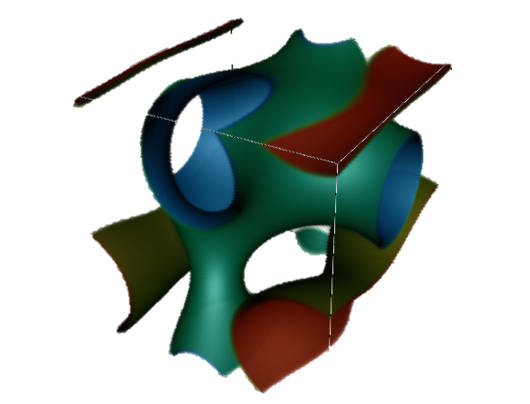

# Symphas


*A compile-time formulated symbolic algebra framework for numerical solutions of phase field problems.*


<p align="center">


</p>
</p>

<p align="center">



</p>


## Introduction to *SymPhas*

Phase field modeling is an approach for simulating the microstructure evolution of various materials and systems, with far reaching applications from common dendrite growth to reaction-diffusion systems to damage and fracture models to biological systems. By representing the dynamics of one or more fields through coupled dynamical equations, one is able to solve the system of PDEs to time evolve the system.  

*SymPhas* has been developed as an API that, when combined with a driver file, uses a chosen numerical solver to generate solutions to a given phase field model. The model can be any type that is expressed as a set of dynamical equations. In other words, *SymPhas* supports **any** multi-phase field problem that can be formulated field-theoretically. The numerical solvers in *SymPhas* are those which are based on uniform grids, such as finite difference solvers.

The primary advantages that *SymPhas* provides are **C-like optimized run times**, **parallelization**, **symbolic algebra**, a modular design for straightforward **third party development**, and **extensive documentation**. A brief list of features offered by *SymPhas* are:

- An optimized symbolic algebra functionality that fully formulates expression trees at compile time to evaluate an expression without branching at runtime. This is coupled with a rich symbolic algebra feature set to give the user significant ability to transform, manipulate and manage expressions.
- Template meta-programming design that optimizes control paths and eliminates branching, providing fast runtimes with linear scaling for any type of model.
- Modular framework with object design and interactions based on the physical phase field problem. Separation between functional components, and separation between functional elements within components. Alongside documentation, this ensures development and extension by users is as convenient as possible.
- Multiple numerical solvers and extensive support for integration of user-implemented numerical solvers. 


> *SymPhas is free software, distributed under the **GNU Lesser General
Public License (LGPL), version 3**. SymPhas is designed and distributed with community development
in mind, and we greatly appreciate contributions and feedback about bugs. This will not only help
keep SymPhas as a valuable phase-field simulations API, but support research by
ensuring other people's results can be reproduced correctly!
You can let us know about bugs via the GitHub issues page.*
> 
> *For any major modifications to SymPhas you would wish to be included, 
> please ensure that SymPhas can compile the examples provided and the
different CMake configurations. If you would like to distribute a modified version 
or use part of SymPhas in your own program, the project must still be licensed using
the same license as SymPhas, which is LGPL v3. It also must clearly be labeled as
derived work.*
>
> *Since SymPhas is supported purely by academic funding, we kindly ask you cite 
> our paper:*
> 
> - "SymPhas—General purpose software for phase-field, phase-field crystal and reaction-diffusion simulations", Steven A. Silber and Mikko Karttunen, submitted

While our goal is to continue expanding and improving SymPhas to enhance its usefulness for
the research community, our resources are limited. We welcome any support such as
bug reports, code and funding. Please feel free to contact the developers if you
wish to reach out.

### *SymPhas* Organization

The API is distributed between a collection of several modules:

 - **lib** 
   - Basic elements and functions used in the other modules of *SymPhas*. This includes program parameters, timing, Fourier transforms and more.
   - Defines elements under the `symphas` namespace.
 - **datatypes** 
   - Defines the basic objects and functions used in the finite difference numerical solvers.
   - Defines the <span style="color:blue">`Grid`</span> class and management of grid boundaries.
   - Defines the `grid` namespace.
 - **sym** 
   - Defines all symbolic algebra elements and their functionality.
   - Defines rules of symbolic algebra expressions.
   - Defines the `expr` namespace.
 - **sol** 
   - Consolidates functionalities of the **sym** and **datatypes** modules into a solution framework for applying numerical solvers.
   - Defines the <span style="color:blue">`Solver`</span> and <span style="color:blue">`Model`</span> classes.
   - Defines finite difference stencils, <span style="color:blue">`Stencil`</span> for up to 4th order derivatives.
 - **io** (optional)
   - Defines functionality for input and output.
   - Defines elements under the `symphas::io` namespace. 
 - **conf** (optional) 
   - Allows reading and writing configuration files.

The modules required for the simplest build of Symphas are **lib**, 
**datatypes**, **sym** and **sol**.

## Getting Started with *SymPhas*


### Download

The entire *SymPhas* package can be downloaded from https://github.com/SoftSimu/SymPhas from the `release` branch. The package can be obtained by either downloading the repository packaged as a zip (i.e. through the Github website) or by cloning the repository, which will make it convenient to be up to date with the latest development.

The *SymPhas* package comes with predefined model definitions and solvers, but can also be installed as a standalone API where the user defines custom solvers and driver.


### Installation and Requirements

The compilation is cross-platform compatible through CMake for either the Linux or Windows (Windows 7 and 10 are both compatible) platforms. CMake version 3.14 or higher is required for compiling and installing. The minimum required versions of the compilers which are verified to work are:

|Compiler|Tested Minimum Version|
|--------|-------|
|MSVC++|14.28|
|gcc7| 7.5|
|gcc10|10.2|
|clang|11.0.1|

> **_SymPhas_ uses the C++17 standard**. Depending on the compiler, this usually has to be explicitly indicated when compiling, either on the command line or in the CMake configuration.

Third party packages that are used and the version they have been tested with are as follows:

|Package|Tested Minimum Version|Required?|
|-------|----------------------|---------|
|[FFTW3](http://www.fftw.org/)|3.3.7|Yes|
|[xdrfile](https://github.com/SoftSimu/libxdrfile)|2.1.2|No|
|[VTK](https://vtk.org/download/)|9.0|No|

For any packages which are not required, they will automatically be excluded from the CMake build process if they are not found. If the required packages are not found, then the CMake configuration step will fail, in which case, the user can provide CMake with the installation location of that package.

The xdrfile package will allow output to the binary xdr format used in Gromacs. This is recommended if the output is very large. Additionally, VTK is recommended if real-time visualization is desired.

When installing *SymPhas*, it is recommended to install to a directory which different from the system install directory (`/usr` or your home directory), and also name the installation output according to the configuration, as it may be desirable to install multiple configurations at once. An example would be having one installation configured only with the core modules (e.g., so headers are installed to `/usr/include/symphas-base/`), or another configured with all modules (e.g., so headers are installed to `/usr/include/symphas-all`).


#### Linux Installation

**Installing Dependencies**

Follow the below steps to install the dependencies.  If any of the packages are installed to a directory not in the CMake search directories, the location will have to be provided during the CMake configuration of *SymPhas*. 

- **FFTW3** 
  
    To install FFTW, first download the source and then use CMake to configure and install the library.

  > Note: Do not configure using the installation steps [here](http://www.fftw.org/fftw3_doc/Installation-and-Customization.html), as this will result in the package not being found by CMake.

- **xdrfile**
    
    Installing the xdrfile package is optional. Download the xdrfile source repository from the Github link provided above, or clone it using `git`, and follow the instructions provided therein to configure and install using CMake.

- **VTK**
    
    Installing VTK is optional. Download the source from the website and install VTK using CMake. Select the configurations which best suit you.    

**Installing _SymPhas_**


Once *SymPhas* has been downloaded, use CMake to configure the build and installation process. Downloading and configuring can be done with:
    
    git clone https://github.com/SoftSimu/SymPhas
    cd SymPhas
    git checkout release
    mkdir ./symphas-build
    cd symphas-build
    cmake -DCMAKE_INSTALL_PREFIX=/path/to/install ..

> If you wish to use *SymPhas* headers and library without specifying the location directly to the compiler, then change `CMAKE_INSTALL_PREFIX` to the primary installation directory of your system. This directory is typically `/usr`.

Using the downloaded source directory `/path/of/download`, this will populate the current directory, `symphas-build`, with the default build configuration files and set the installation path of *SymPhas* to `/path/to/install`. Cache variables may be provided to the `cmake` invocation after the directory specification to change the configuration. The cache variables are listed and described in [**Advanced Installation**](#advanced-installation). 
If using a graphical interface to CMake, then all the variables and descriptions will be listed. 

> In a graphical interface, some variables may not appear until prerequisite variables are defined. Ensure that the project is fully configured by repeating the configuration step after any modification of variables.


Once *SymPhas* has been configured, execute the following commands to build and then install *SymPhas*:

    make
    make install

A new driver file may now be created, compiled and linked to the *SymPhas* API. 


#### Windows Installation

The following tools are available on Windows for configuring, building and installing CMake projects:

-  [CMake](https://cmake.org/download/) for Windows.
-  [Visual Studio](https://visualstudio.microsoft.com/vs/)  
   - It must be installed with the Desktop Development for C++ component.
   - Community version is free to use.
- [Visual Studio Code](https://code.visualstudio.com/)
  - Visual C++ (MSVC++) compilers are required, and are obtained from the [C/C++ for Visual Studio Code](https://code.visualstudio.com/docs/languages/cpp) extension.
  - The [CMake Tools](https://marketplace.visualstudio.com/items?itemName=ms-vscode.cmake-tools&ssr=false#overview) extension is also required.

It is beyond the scope of this installation guide to provide a detailed procedure of using these tools to configure a CMake project, but these tools can be used in several ways to set up *SymPhas* and its dependencies on Windows. 
- Using CMake for the Windows platform alongside Visual Studio.
- Using only Visual Studio (with Desktop Development for C++ component installed). 
- Using Visual Studio Code.


**Installing Dependencies**

Using any of the methods above, the dependencies can be installed with the respective CMake tool, following the same instructions as in [Linux Installation](#linux-installation).  

> **Note**: xdrfile must be configured with the `BUILD_ARCHIVE` flag set to true in order to be used in the *SymPhas* build for the Windows platform.

**Installing _SymPhas_**

Use any of the methods above to configure a CMake project. Set `CMAKE_INSTALL_PREFIX` to the desired installation directory when configuring.
After the CMake project is configured, compile and install the project using the appropriate tool or program.


### Advanced Installation

When configuring *SymPhas*, providing the variable `COMBINE_SHARED` set to true to the CMake invocation, a shared library called `symphas_all` will be created which **combines all the modules** built for that configuration. This is useful when compiling a driver file with `g++`, so that only a single _SymPhas_ library needs to be provided to the command line. The disadvantage is that the compile time will be increased.

The following is a list of all CMake cache variables used for configuring *SymPhas*.

- `MODEL_CALL_FUNCTION` A function templated on the specialized model type. When models are associated with string names (see `LINK_WITH_NAME` in the documentation for details), selecting a model will invoke this function with the concrete model type passed as a template parameter. The full usage of this parameter is described in the documentation. Empty by default.

  > Models **cannot** be associated or selected by string names in an installation that does not have `MODEL_CALL_FUNCTION` configured. 

- `BASIC_STENCILS` When this is true, configures the build so that only a small subset of stencils are allowed in the model selection, rather than all the stencils. By compiling with all the stencils, the compile times will dramatically increase, because a concrete type is generated for each stencil-model combination. False by default.

- `MODEL_INCLUDE_HEADER_NAME` The name of the file containing the model definitions. If model definitions are distributed between multiple header files, then this file will include each one in order to combine all model definitions. This is empty by default.

  > When `MODEL_INCLUDE_HEADER_NAME` is configured, macros associated with model definitions are undefined after including the model definitions header in order to avoid name conflicts. Consequently, models cannot be defined elsewhere, such as in the driver file. If it is not configured, models must be specified through the driver file or by providing to the compiler the definition `MODEL_INCLUDE_HEADER` set to the name of the model definitions header.

- `MODEL_INCLUDE_HEADER_DIR` The directory containing the file `MODEL_INCLUDE_HEADER_NAME`. All files included by this file must also exist in this directory. If this is a relative path, this will be relative to the source code root directory (that is, relative to \lstinline{CMakeLists.txt}). This is \lstinline{.} (the current working directory) by default.

- `SOLVER_INCLUDE_HEADER_NAME` The name of the file defining all the solvers. If solvers are defined in multiple header files, then this file includes those solvers which are desired to be compiled. This is empty by default.

- `SOLVER_INCLUDE_HEADER_DIR` The directory containing the file `SOLVER_INCLUDE_HEADER_NAME` and solver definitions. All files included by this file must also exist in this directory. If this is a relative path, this will be relative to the source code root directory (relative to `CMakeLists.txt`). This is `.` by default.

- `PRINTABLE_EQUATIONS` Ensures that all equations and transformed expressions can still appear as coherent text when printed. Sometimes, particularly in the case of large expressions and significant transformations on those expressions, runtimes will be shorter when this is false. This is true by default.

- `USE_IO` Enable the use of the **io** module.

- `USE_CONF` Enable compilation and usage of the **conf** module. Requires `USE_IO` to be true.

- `USE_VTK` Enable compiling with the VTK library to use real time visualization. 


#### Installing Provided Solvers and Model Definitions

The source code is provided with solvers already available and can be found in the folder `examples/solvers` in the root directory. There are also model definitions  available in the `models` folder in the root directory.

These can be specified in the CMake configuration with the variables above, in which case installing *SymPhas* will also put the solvers and models in the installation directory, allowing them to be accessed through any driver file.


## *SymPhas* API basics

Each element in *SymPhas* is extensively documented in Doxygen, and the listing can be found in `docs` in the source code root directory. This section will describe how they are all used together, starting with a simple example of a driver file. A driver file requires at least one solver definition in a separate header file, and at least one model definition, defined either within in the driver file, or outside in a separate header file.

In describing elements in *SymPhas*, colour coding is applied to some names. The meaning of the colours is:

| Color | Meaning |
|-------|---------|
|<span style="color:blue">`blue`</span> | Represents a functional class in *SymPhas*. |
|<span style="color:teal">`teal`</span>| A class that represents problem information. |
|<span style="color:purple">`purple`</span>| An important C++ macro. |
|<span style="color:violet">`violet`</span> | An enum class. |


A driver file can be configured and compiled with CMake by including *SymPhas* with the `find_package` command, or compiled directly with `g++` by specifying the include and library directories. These processes will be described in more detail through the examples below.

> Before writing or using any driver file, locate the solver definitions. Depending on the installation configuration, these might be included in the installation directory. If there are no solvers in the installation directory, they must be added when building the driver by passing to the compiler the definition `SOLVER_INCLUDE_HEADER` set to the solver definitions header. Solvers are required for building the driver and running any simulation.


### A First Program

From the source code root directory, the example discussed in this section can be found in `examples/first-driver`. Included in this directory are two files: `main.cpp`, a driver file with its own model definition, and `CMakeLists.txt` for configuring the CMake project. This driver file uses essential elements of *SymPhas*, ideal for describing the functionality and usage of *SymPhas*.


#### Description and Walkthrough

The driver file presents a very simple scenario where a single model is defined and solved. This begins by including the *SymPhas* header, `symphas.h`, which includes all SymPhas components that were installed, and is required by any driver file. The model definition follows.

```cpp
#include <symphas.h>

#define psi op(1)
#define dpsi dop(1)

MODEL(EX, (SCALAR),
MODEL_DEF(
  dpsi = lap(psi) + (c1 - lit(4.) * c2 * psi * psi) * psi)
)
```

In its simplest form, the model definition is constructed using C++ macros defined within *SymPhas*, beginning with the macro <span style="color:purple">`MODEL`</span>, which takes at least three arguments:

- The model name, which can be any C++ compliant name;
- The phase field types, surrounded by parentheses, and are any of <span style="color:purple">`SCALAR`</span>, <span style="color:purple">`COMPLEX`</span> or <span style="color:purple">`VECTOR`</span>; and
- The dynamical equations, specified by providing the equations to the macro <span style="color:purple">`MODEL_DEF`</span>.

In the equation, the order parameter of index `N` is referred to by `op(N)`, and its time derivative is `dop(N)`. The dynamical equation of field `N` has the form: `dop(N) = ...`. The characters `c1` through `c5` are coefficients of the model that are passed upon model construction, with default value 1.

The first two lines use macro definitions to create a new name for the order parameter and its derivative with respect to time, to make it easier to use in the model definition. The model definition represents a phase field system with a real-valued order parameter evolved according to the equation:

<p align="center">

</p>

> The definition of a model introduces to the global namespace a type alias, `model_<NAME>_t`  for the model class, where `<NAME>` is the name of the model. This is referenced later in the file to create the model. Refer to [Defining Models](#defining-models) for more information about this.

After the model definition, the `main` function is defined (program entry point), and directly specifies the simulation that will be performed.

In the main function, the model is created and the numerical solution is computed. Before initializing the model, the problem parameters have to be specified via the class <span style="color:teal">`problem_parameters_type`</span> in the `symphas` namespace. The configuration model **conf** offers an automatic way to do this by parsing an input file; refer to section [Configuration](#configuration). Initializing the problem parameters object is done in the line:

```cpp
symphas::problem_parameters_type pp{ 1 };
```

where `1` is passed to indicate the problem parameters is for a single field. The problem parameters instance is invalid at this stage, and requires information about the phase field systems, provided as arrays to the member functions:

- The axis intervals of the phase field systems:  
   
    ```set_interval_data```


- The boundary specifications of the phase field system: 
   
    ```set_boundary_data```


- The initial conditions used to seed the phase field system:  
   
    ```set_initial_data```

> The order of the elements in the data arrays corresponds to the order of the phase fields as they are defined in the model definition. In other words, the phase fields are initialized from the problem parameters data element whose index corresponds to the phase field index in the model definition. 

The problem parameters also takes the solution time step, `dt`, used to initialize the solver. 

> In cases where the solver is not initialized with the time step from the problem parameters, then the time step provided to the step routine is the one used. How the time step provided to the step routine is used by the solver depends on the solver implementation.

The main function begins by setting up the problem parameters by initializing each of the data elements first:


```cpp
double dt = 0.5;
symphas::problem_parameters_type pp{ 1 };
symphas::b_data_type bdata;
symphas::interval_data_type vdata;
symphas::init_data_type tdata{ Inside::UNIFORM, { -1, 1 } };

bdata[Side::LEFT] = BoundaryType::PERIODIC;
bdata[Side::RIGHT] = BoundaryType::PERIODIC;
bdata[Side::TOP] = BoundaryType::PERIODIC;
bdata[Side::BOTTOM] = BoundaryType::PERIODIC;

symphas::interval_element_type interval;
interval.set_interval_count(0, 80, 128);

vdata[Axis::X] = interval;
vdata[Axis::Y] = interval;
```

It is recommended to refer the documentation of these objects to know their usage specifics, as what follows is only a brief explanation related to this example.


The objects <span style="color:teal">`b_data_type`</span>, <span style="color:teal">`init_data_type`</span> and <span style="color:teal">`interval_data_type`</span> in the `symphas` namespace represent the type of the boundary, initial condition and interval data, respectively. First, the boundary and interval data objects are constructed:

```cpp
symphas::b_data_type bdata;
symphas::interval_data_type vdata;
```

In order to construct the initial data, the parameters are passed directly to the constructor:

```cpp
symphas::init_data_type tdata{ Inside::UNIFORM, { -1, 1 } };
```

This establishes the initial condition of the phase field to be the uniform distribution in the range [-1, 1]. In particular, each point of the phase field is generated by seeding it with the uniform distribution with values between -1 and 1.

The boundary data is now generated:

```cpp
bdata[Side::LEFT] = BoundaryType::PERIODIC;
bdata[Side::RIGHT] = BoundaryType::PERIODIC;
bdata[Side::TOP] = BoundaryType::PERIODIC;
bdata[Side::BOTTOM] = BoundaryType::PERIODIC;
```

Each line creates a new entry for the specified <span style="color:violet">`Side`</span> in `bdata` of type <span style="color:teal">`b_element_type`</span>. A shorthand is available which associates a <span style="color:violet">`BoundaryType`</span> with a <span style="color:teal">`b_element_type`</span>, thereby directly constructing the entry. This defines the boundary conditions on all sides of the system, and each side must be explicitly specified, otherwise the problem parameters are in an invalid state.

Next, an interval is initialized and constructed:
```cpp
symphas::interval_element_type interval;
interval.set_interval_count(0, 80, 128);
```

This creates the object `interval` that represents an interval in [0, 80] with 128 discrete points. Next, the interval is used to initialize the interval data for the problem parameters by associating specific sides to the interval:


```cpp
vdata[Axis::X] = interval;
vdata[Axis::Y] = interval;
```

Finally, the model can be created:

```cpp
model_EX_t<2, SolverSP<Stencil2d2h<5, 9, 6>>> model{ pp };
```

The model type corresponding to the defined model is a template type of two types: the dimension of the problem and the solver that should be used, respectively. This line therefore initializes the model as a 2-dimensional problem and specifies that the used solver is `SolverSP<Stencil2d2h<5, 9, 6>>` (see [Solvers](#solvers) for more details).

To solve the new constructed phase field problem, the function is called:
```cpp
symphas::find_solution(model, dt, 100);
```
which will perform 100 solver iterations. Although the time step `dt` is provided to this function, depending on the solver implementation, the value may not be used. For example, the provided spectral
solver <span style="color:blue">`SolverSP`</span> computes solution data based only on the time step which was provided at model construction, and does not update it afterwards.

A copy of the phase field can be obtained with:

```cpp
auto pfdata = model.grid<0>();
```
which takes the first phase field in the 0-indexed list from the model. 

> The resulting type of the function called on last line is <span style="color:blue">`Grid`</span>, templated on the phase field type and the model dimension. In this case, it would be the type `Grid<scalar_t, 2>`.

#### Executing the First Program

**Linux**

To compile this program, there are two options. The first is using CMake with the provided `CMakeLists.txt`. This offers the potential for more customization as well as better management of larger projects. The second option is using `g++`, more appropriate for this single driver file. To compile this driver file with `g++`, install *SymPhas* and see the section [Compiling and Running](#compiling-and-running).

The CMake compilation can be configured by creating a directory `build` inside the `simple-driver` directory and executing the following command from inside `build`:

```properties
cmake -DCMAKE_BUILD_TYPE:STRING="Release" -DUSE_IO:BOOL="True" -DSOLVER_INCLUDE_HEADER_DIR:PATH="../solvers" -DSOLVER_INCLUDE_HEADER_NAME:FILEPATH="solverinclude.h" ..
```

This can be directly executed and does not require the *SymPhas* package to be installed beforehand. The reason is that the configuration provided in `CMakeLists.txt` will add the source code directory as a subdirectory to this build. This will also add the **io** module to the build.

> The `solvers` directory is added relative to the `CMakeLists.txt` file which is being executed.

Defining the variables:

```properties
-DMODEL_INCLUDE_HEADER_DIR:PATH="../models" -DMODEL_INCLUDE_HEADER_NAME:FILEPATH="modelinclude.h" 
```

will add all the models included in *SymPhas*, but will require that the model defined in `main.cpp` is removed or commented away.

Subsequently running `make` will create an executable `symphas_impl`.

**Windows**

See [Compiling and Running](#compiling-and-running) for Windows.


### Compiling and Running

*Always ensure that the build directory is clean.*

**Linux**

There are two options to build and run a program, and both require that *SymPhas* has been installed. The first is using CMake and importing *SymPhas* with `find_library(SymPhas)`. In order to add the *SymPhas* library, the variable `${SymPhas_LIBRARIES}` is provided. CMake offers the potential for customization as well as better management of larger projects. 

> As shown in the example of compiling the simple driver program, it is also possible to make a CMake project which uses the *SymPhas* source code directly, but typically it is best practise to install *SymPhas* with the desired configuration and add it through `find_library`. 

The second option is using `g++`, and typically more appropriate for a single driver file. To compile a driver file with `g++`, provide the location of the installed headers and the library; these will come from the install step. The library directory also needs to be listed in the system variable `LD_LIBRARY_PATH`. In the following commands, it is assumed that *SymPhas* was installed in `/symphas/install/folder/`, use:

```properties
export LD_LIBRARY_PATH=$LD_LIBRARY_PATH:/symphas/install/folder/lib
```

If the include and library files were installed to `/usr`, then these arguments can be omitted and `LD_LIBRARY_PATH` does not have to be modified.

If `COMBINE_SHARED` was **enabled** in the CMake configuration step of the installation, only a single link to *SymPhas* needs to be indicated by adding `-lsymphas_all`. 
This shared library compiles all object files that were used to compile the individual modules, so there is no explicit library dependence. If the driver file is called `main.cpp`, then `g++` is invoked with:

```properties
g++ main.cpp -std=c++17 -I/symphas/install/folder/include -L/symphas/install/folder/lib -lsymphas_all -ltbb
```

Note the dependence on the `tbb` library.

> The compiler option `-std=c++17` is 
> included because *SymPhas* requires the C++17 specification. Typically, this is not
> the default selection of the compiler so this argument must be explicitly included.
 
This will generate an executable `a.out` in the current working directory.

If `COMBINE_SHARED` was **not provided** or is **false** in the CMake configuration step of the installation, then `-lsymphas_all` would be replaced with `-lSymPhas -l...` where `...` indicates the library files of individual modules. For example, for a base installation:

```properties
g++ main.cpp -std=c++17 -I/symphas/install/folder/include -L/symphas/install/folder/lib -lSymPhas -lsymphas_lib -lsymphas_datatypes -lsymphas_sym -lsymphas_sol -ltbb
```

The shared libraries generated for each of the modules of *SymPhas* need to be explicitly linked since they are all used in the driver through the *SymPhas* header. If additional modules were enabled during the installation, then those would also have to be linked even if the driver does not directly use them.

> If the **io** module is enabled, linking with the `pthread` library is also required. The headers define a class that creates a new thread which asynchronously writes phase field data. Add `-lpthread` to the compile command.

**Windows**

There are two options to compile in Windows, one of which is CMake. The other option is creating a new Visual Studio C++ project. In either method, the resulting executable requires that the shared libraries from both *SymPhas* and its dependencies are together in the folder with the executable. The simple method is copying all the necessary shared libraries after the program is compiled, as this only has to be done once, unless that folder is cleared in a clean process or otherwise deleted.


## Symbolic Algebra

The symbolic algebra library is a very powerful part of *SymPhas*, equipped with full featured functionality including various expression types, a large set of expression rules and the ability to define custom expression algebra data objects. The primary function of the symbolic algebra is to define the equations of motion, but it can also be used as a standalone feature.

For a list of available expression objects, refer to Modules -> Symbolic Algebra Modules, which also includes an explanation for defining custom data objects for use in the symbolic algebra library. This section outlines a brief tutorial.

A typical use of symbolic algebra is operating on a grid in a point-wise fashion. An instance of the type <span style="color:blue">`Grid`</span> is the data that is operated on. The following code will create a grid, define a variable to represent the grid, and then obtain the result of the square of the variable to update the grid.

```cpp
Grid<scalar_t, 2> gridu({ 10, 10 });     // Creates a grid of dimensions 10 x 10.

// Fill the grid with random values.
srand (time(NULL));
std::generate(
    gridu.values, 
    gridu.values + gridu.len, 
    [](){ return rand() / RAND_MAX; }
);

auto u = expr::make_op(gridu);           // Create a variable from the grid.
expr::result(u = u * u);                 // Evaluate the result of squaring u, saving it back to u.
```

Another, longer example is given, assuming there are two grids, `gridu` and `gridv`, both randomly generated as above.
```cpp
// Define variables u and v of the grids.
auto u = expr::make_op(gridu);
auto v = expr::make_op(gridv);

// Define an expression of u and v.
auto a0 = expr::make_literal(2.5);
auto a1 = expr::make_literal(10);
auto expr = v + a0 * expr::pow<3>(u) + v / (a1 * u);

// Store the result objects.
auto resultu = (u = expr);
auto resultv = (v = expr + v);

// Update the grids u and v.
expr::result(resultu);
expr::result(resultv);
```

The variable `expr` above is equivalent to:
<p align="center">

</p>

In order to get `u` to the power of 3, it is possible to multiply `u` three times, or use the function `expr::pow` as above (which is functionally the same thing), a template function with template parameter of non-negative integer.


### Printing Expressions

Expressions can be printed, and when the cmake option `PRINTABLE_EQUATIONS` set to true, all expressions are guaranteed to be printable (if it is false, some expressions will be named automatically, and therefore not have a meaningful string representation). Expressions can be print to a file or print to a `char` array (C-style string). 
In order to print an expression `expr` to a file `f`, use: 

```cpp
expr.print(f); // Prints the expression to the given file stream.
```

To print to a string, a preliminary step is required, which is to ensure that the string buffer is sufficiently sized. The length of the expression is obtained through
the member function `print_length()`:

```cpp
char *out = new char[expr.print_length() + 1];
expr.print(out); // Prints the expression to the string.
```


> By setting the cmake option `LATEX_FORMAT` to true, the expressions are printed in LaTeX format, in order to be copied directly into a LaTeX file and be compiled.


## Defining Models

A full model definition takes the form:

```cpp
MODEL(
    NAME,                       // Name given to the model.
    (TYPE1, TYPE2, ...),        // Types of one or more order parameters.
    PROVISIONAL_DEF(            // Defining provisional variables is optional.
        (VTYPE1, VTYPE2, ...)   // Types of one more provisional variables.
        var(1) = ...,           // This is the definition of the first provisional 
                                //    variable, and is of type VTYPE1.
        var(2) = ...,           // This is the definition of the second provisional 
                                //    variable, and is of type VTYPE2.
        ...                     // More provisional variable definitions.
    )
    MODEL_PREAMBLE_DEF(
        (
            PREAMBLE            // This is the preamble to the equation
            ...                 //    definitions, and can define elements to
            ...                 //    to use in the equations to make writing
            ...                 //    easier or more clear.
        )
        dop(1) = ...,           // This is the definition of the first order 
                                //    parameter, and is of type TYPE1.
        dop(2) = ...,           // This is the definition of the second order 
                                //    parameter, and is of type TYPE2.
        ...                     // More provisional variable definitions.
    )
)
```
The indexed terms `TYPE` refers to the order parameter types, and `VTYPE` refers to the provisional variable types. These are any of <span style="color:purple">`SCALAR`</span>, <span style="color:purple">`COMPLEX`</span> or <span style="color:purple">`VECTOR`</span>. The equations are always given as a comma delimited list.

The <span style="color:purple">`PROVISIONAL_DEF`</span> section is entirely optional and can be omitted in a model definition.

A model definition results in the type `model_<NAME>_t`, where `<NAME>` is the given model name. This is the alias to the actual model object that is defined by invoking these macros. The alias is a template of two types: the dimension and the solver type. In order to instantiate a model instance, these template arguments must be provided to the alias to constitute a concrete type.

In the documentation, refer to the following items for clear explanations of the above:

- <span style="color:purple">`MODEL`</span>:  
   The beginning of a model definition. This takes all the terms associated
with defining a model and constructs one.
- <span style="color:purple">`MODEL_PREAMBLE_DEF`</span> or <span style="color:purple">`MODEL_DEF`</span>:   
   The macros to which the equations of motion are provided. The documentation for the macro <span style="color:purple">`MODEL_PREAMBLE_DEF`</span> contains all the information about defining an equation of motion for the model. This is also pasted, in part, below. The documentation also refers to how to use `PREAMBLE`.

### Writing an Equation of Motion

The following derivatives of expressions are
supported:
- `grad(E)`
- `lap(E)`
- `gradlap(E)`
- `bilap(E)`

where `E` is the expression that is being differentiated.

Derivatives of higher orders can also be specified using `dx(O)`, where `O`
is the desired order. The usage of `dx` is different from the derivatives
above, as in order to apply it, it must be multiplied by an expression. This
applies the derivative to the expression using symbolic algebra rules.

When `O` < 5, then it is equivalent to the 
functions above when multiplied by an expression. 

A unique aspect of using `dx` is that it can be added to another 
`dx` of a different order to create a new operator. I.e.:

```cpp
dop(1) = (dx(2) + dx(4)) * op(1)
```

To use the model coefficients, there is the macro `param(N)`, where `N` 
refers to the `N`-th coefficient in the that is given to the model, as a
1-indexed list. That is, the first coefficient is `param(1)`.

Constants are used with `lit(v)`, where `v` is the value of the constant.

Imaginary numbers are also included. An imaginary number is referenced
using the term `Ii`. The following operations of imaginary numbers are supported:
- `modulus(Z)`, the modulus of the number.
- `conj(Z)`, the conjugate of the number.
- `Re(Z)`, the real part of the complex number.
- `Im(Z)`, the imaginary part of the complex number.

where `Z` is the complex number. This usage applies to the order parameter
as well, not just coefficients.

It is also possible to use the Gaussian kernel in the equations of motion,
which is a grid of the wavenumbers. Refer to the documentation for OpFuncConvolution.

Also, where the number 1 (i.e. the multiplicative identity) should be used
in an expression explicitly, it is recommended to use `one`, to maximize
the advantage of the compile-time symbolic algebra.


## Running Models

In order to execute models, an instance of object  <span style="color:teal">`problem_parameters_type`</span> must be constructed
and appropriately initialized through its member functions. This is based on the parameters that represent a phase field problem in a physical setting:

- The initial conditions.
- The boundary conditions.
- The size of the system and the spatial discretization.

Once this information is provided to the  <span style="color:teal">`problem_parameters_type`</span> instance, it is used to initialize the specialized model by providing it as an argument to the constructor.

### Initializing the Problem Parameters

This process can be automated by the **conf** module. By providing a configuration file, the module will parse the information and construct a parameters object.

To do this manually, each element of the parameters must be manually constructed. 

#### Constructing the Initial Conditions

The initial conditions are represented by the object <span style="color:teal">`init_data_type`</span>. This contains the following information:

- `in` A representation of the initial condition as an <span style="color:violet">`Inside`</span> value.
- `intag` A number that indicates a variation of the initial condition is used.
- One of either:
  - `data` Parameters of the initial algorithm generation.
  - `file` A file that the data is read from, as a <span style="color:teal">`init_data_read`</span> object.
  - `f_init` A wrapper for a functor which returns values for the initial condition, instead of the following algorithms.

> The `intag` is a number that represents up to two enum <span style="color:violet">`InsideTag`</span> values. There are constructor overloads of <span style="color:teal">`init_data_type`</span> that allow either a single <span style="color:violet">`InsideTag`</span> or a number representing the combination of <span style="color:violet">`InsideTag`</span> values to be provided. Constructing an `intag` value is done using the `symphas::build_intag` function.

An <span style="color:violet">`Inside`</span> is an enum with values from the list:

| Value | Description | Variations |
|------------|--------------------------------------|-------------|
|`GAUSSIAN`| 		Uses a Gaussian distribution to randomly assign values.|  *None* |
|`UNIFORM`| 			Uses a uniform distribution to randomly assign values.| *None* |
|`CAPPED`| 			Values are assigned to be either the minimum or maximum parameter.| *None* |
|`CONSTANT`|			All values are assigned to the same parameter.| *None* |
|`CIRCLE`| 			Value are assigned to be the shape of a circle.| `RANDOM`, `A`, `A+RANDOM` |
|`HEXAGONAL`| 		Values are assigned into circles arranged in a hexagonal pattern.| `RANDOM` |
|`CUBIC`| 			Values are assigned into circles arranged in a cubic pattern.| `RANDOM` |
|`SQUARE`|			Values are assigned to be the shape of a square.| `RANDOM`, `A`, `A+RANDOM` |
|`SQUARESEEDS`| 		Values are put into randomly arranged squares.| `RANDOM`, `A`, `A+RANDOM`, `B`, `B+RANDOM`  |
|`CIRCLESEEDS`|		Values are put into randomly arranged circles.| `RANDOM`, `A`, `A+RANDOM`, `B`, `B+RANDOM` |
|`FILE`| 			Values are read in from a file.| *None* |
|`CHECKPOINT`|		Values are read in from a checkpoint.| *None* |
|`NONE`|				Represents no initial condition.| *None* |

An <span style="color:violet">`InsideTag`</span> is an enum with values from the list: 

|Value | Description |
|--------|---------------|
| `DEFAULT`|	The default initial generation algorithm is chosen.|
| `RANDOM`|		The generation is modified to include some kind of randomness.|
| `VARA`|		The A variation is chosen (different from the default variation).|
| `VARB`|		The B variation is chosen.|
| `INVERT`|		The interior and outer values are switched in the generation. <br> (In some algorithms, the generated value is multiplied by -1.)|
| `NONE`|	Represents no tag.|

The table that lists <span style="color:violet">`Inside`</span> values also lists the variations that are compatible with that initial condition. All initial conditions support the `INVERT` tag except the last three, and an initial condition without a tag is considered to be the `DEFAULT` variation.

If an initial condition is generated with <span style="color:violet">`Inside`</span>`::NONE` and <span style="color:violet">`InsideTag`</span>`::NONE`, then no values are populated. If an initial condition is combined with an invalid modifier, the program reports an error and no values will be populated. The default constructed  <span style="color:teal">`init_data_type`</span> is initialized with <span style="color:violet">`Inside`</span>`::NONE` and <span style="color:violet">`InsideTag`</span>`::NONE`, so it is valid but will not generate any initial conditions.

> Future releases of *SymPhas* might add more values of the above enums, refer directly to
> the documentation for full details.

Some initial conditions have more than one variation associated with the algorithm which populates the values, and are selected by a number representing an <span style="color:violet">`InsideTag`</span> combination. For example, most algorithms support the <span style="color:violet">`InsideTag`</span>`::RANDOM` modifier. Refer to the documentation of class `InitialConditions`, which implements all the algorithms and fully describes each of the generation algorithms. All initial conditions are defined by specializing `InitialConditionsAlg` for the  <span style="color:violet">`Inside`</span> value and  <span style="color:violet">`InsideTag`</span> values.

**Custom Initial Conditions**

The method of algorithm types (based on  <span style="color:violet">`Inside`</span> values) and variations thereof is designed to accommodate configuration-based initial condition selection. However, initial condition generation is not restricted to the available algorithms, and can apply user defined algorithms instead. The requirement on the
user supplied algorithm is that it must be a functor-like object that can be called with the argument types: `iter_type` (the "flattened" index of the value of the system to generate), `len_type const*` (the dimensions of the system) and `size_t` (the number of dimensions), and returning any type of the valid order parameter types (`scalar_t`, `complex_t` or `vector_t` of 1, 2 or 3 dimensions). A trivial example is the following lambda:

```cpp
auto all_one = [](iter_type, len_type const*, size_t dimension) -> scalar_t { return dimension; };
```
This algorithm would populate the entire system with a value equal to the dimension of the system. 

To actually use an algorithm, it is passed directly to the <span style="color:teal">`init_data_type`</span> constructor, in place of any enum values or initial condition parameters. For example, the above algorithm would be used to construct the initial conditions with:

```cpp
symphas::init_data_type tdata{ all_one };
```

The following is another example of how to pass an initial condition algorithm based on a custom functor object that is not a lambda:

```cpp
struct MirrorInitAlg
{
    MirrorInitAlg(double constant) : constant{ constant } {}
    scalar_t operator()(iter_type n, len_type const* dims, size_t dimension) const
    {
        if (dimension == 2)
        {
            axis_coord_t x = n % dims[0];
            return (x < dims[0] / 2) ? constant : -constant;
        }
        return 0;
    }

    double constant;
};

int main()
{
    symphas::init_data_type tdata{ MirrorInitAlg{ 1.0 } };
    return 0;
}
```
This algorithm would populate half a 2-dimensional system with the given constant, and the other half with negative of the given constant. For any other dimension, the initial conditions would be uniformly 0.


#### Constructing the Boundary Conditions

The data container which represents information about boundary conditions in the context of the problem parameters is represented by `b_data_type`, a map that relates the enum `Side` to an object `b_element_type`.

 A `Side` value is any of `LEFT`, `RIGHT`, `BOTTOM`, `TOP`, `FRONT` and `BACK`.
While the notion of a "side" of a system can be extended to other coordinate systems since it is only based on a surface bounded by a set of the intervals, these names are chosen since the design of *SymPhas* solvers is based in a Cartesian coordinate system. 

It is assumed that the system is oriented such that *x* is the horizontal axis, *y* is the vertical axis, and *z* is the depth axis. Hence, `LEFT` and `RIGHT` are surfaces with an *x*-axis normal vector, `BOTTOM` and `TOP` are surfaces with an *y*-axis normal vector and `FRONT` and `BACK` are surfaces with an *z*-axis normal vector.

> A 1-dimensional system is fully represented by the first two `Side` values, a 2-dimensional system by the first four, and a 3-dimensional system is represented with all values.

The relationship of the `Side` value to the dimension of the system can be summarized:

|Value| Axis Point | In 1 dimension <br/> (*x*<sub>0</sub>, *x*<sub>1</sub>) | In 2 dimensions <br/> (*x*<sub>0</sub>, *x*<sub>1</sub>) × (*y*<sub>0</sub>, *y*<sub>1</sub>)  | In 3 dimensions <br/> (*x*<sub>0</sub>, *x*<sub>1</sub>) × (*y*<sub>0</sub>, *y*<sub>1</sub>) × (*z*<sub>0</sub>, *z*<sub>1</sub>)  |
|----------|----|-----------|-----------|-------|
|`LEFT`   |*x*<sub>0</sub> | *x*<sub>0</sub> | *y*-axis at *x*<sub>0</sub> | *zy*-plane at *x*<sub>0</sub> |
|`RIGHT`  |*x*<sub>1</sub> | *x*<sub>1</sub> | *y*-axis at *x*<sub>1</sub> | *zy*-plane at *x*<sub>1</sub> |
|`BOTTOM` |*y*<sub>0</sub> | -   | *x*-axis at *y*<sub>0</sub> | *zx*-plane at *y*<sub>0</sub> |
|`TOP`    |*y*<sub>1</sub> | -   | *x*-axis at *y*<sub>1</sub> | *zx*-plane at *y*<sub>1</sub> |
|`FRONT`  |*z*<sub>0</sub> | -   | -                         | *xy*-plane at *z*<sub>0</sub> |
|`BACK`   |*z*<sub>1</sub> | -   | -                         | *xy*-plane at *z*<sub>1</sub> |

Empty entries indicate that the <span style="color:violet">`Side`</span> value is inapplicable to the corresponding dimension. For each <span style="color:violet">`Side`</span> value, the entries in the table describe: 1) the point in the Cartesian coordinate system corresponding to the boundary, and; 2) the boundary in terms of their relationship to a *D*-dimensional system as a (*D*-1)-dimensional object at the boundary point. The latter is best described by example:

- In a 2-dimensional system, the value <span style="color:violet">`Side`</span>`::LEFT` represents the boundary at *x*<sub>0</sub>, given by the equation  which is parallel to the *y*-axis. 
- In a 3-dimensional system, the value <span style="color:violet">`Side`</span>`::BACK` corresponds to the grid points at *z*<sub>1</sub>, which is the boundary that is oriented to the *xy*-plane and given by the equation
 .

In this way, a local coordinate system with origin based on the global coordinate system may be imposed on the boundary, allowing *SymPhas* to treat boundaries as independent systems in order to populate boundary values according to a given function (these are described in the documentation).

A <span style="color:teal">`b_element_type`</span> specifies the boundary information for the corresponding side, containing data for:

- `type` Represents the boundary condition and of type <span style="color:violet">`BoundaryType`</span>.
- `tag` An array of two <span style="color:violet">`BoundaryTag`</span> values, representing a modification of the `type`.
- `params` A list of values used in applying the boundary condition algorithms.
- `args` The number of elements in `params`.


The type of boundary condition is represented by the enum <span style="color:violet">`BoundaryType`</span>. These  are split into two groups: periodic boundary conditions represented by `PERIODIC` and all other boundary conditions, 
which are considered "default", as they apply some function to the boundary to update it. To initialize a <span style="color:teal">`b_element_type`</span>, provide the necessary data to the constructor.


To specify the boundary data of a system, create an instance of <span style="color:teal">`b_data_type`</span> and assign <span style="color:teal">`b_element_type`</span> instances to each <span style="color:violet">`Side`</span> value that is part of the full system representation.
In assigning to <span style="color:teal">`b_data_type`</span>, a <span style="color:violet">`BoundaryType`</span> value can be used instead, in which case the other parameters will be initialized to default values.


#### Constructing the Intervals

The domain of the system is represented by intervals associated with each axis. Each interval represents the extent of the system on the corresponding axis. The interval data is managed by the object <span style="color:teal">`interval_data_type`</span>, which is a map that associates <span style="color:violet">`Axis`</span> values with instances of type <span style="color:teal">`interval_element_type`</span>. The `Axis` values of a system are:

| Value | Corresponding Physical Axis |
|-------|---------|
| `X`   | Horizontal (1, 2 and 3 dimensions)  |
| `Y`   | Vertical (2 and 3 dimensions)       |
| `Z`   | Depth (only 3 dimensions)           |

The table shows the relationship between axes and system dimensions, and shows for which dimensions the `Axis` values are applicable. For example, `Z` is not a valid value for a 1-dimensional system, only the value `X` can be used. This is because, as was similarly mentioned in the description of boundaries, the dimensionality of a system is considered to be an extension of the previous dimension.

The type <span style="color:teal">`interval_element_type`</span> represents a simple interval, unrelated to a specific axis. It stores the endpoints of the interval and the width between discrete elements, *h*.
An instance of <span style="color:teal">`interval_element_type`</span> is constructed using the endpoints along with either the spatial discretization, or the number of discrete points.

The endpoint values when provided to the interval construction are interpreted as [*A*,*B*], meaning that the last endpoint is included in the grid points. The implication is that  *B*-*A*+*h*  is the length of the axis used in computing the number of grid points. This is intended to make interval specification more convenient and clear. For example, specifying that an interval spans from 1 to 64 means that the number of elements is 64 when *h*=1, however, when *h*=0.5, the number of elements is 127 (not 128). 

To specify the interval data of a system, create an instance of <span style="color:teal">`interval_data_type`</span> and assign <span style="color:teal">`interval_element_type`</span> instances to each <span style="color:violet">`Axis`</span> value that is part of the full system representation.


## Solvers

The *SymPhas* API offers an extremely versatile framework to allow the user to develop their own solver, centered primarily around the functionality provided by the symbolic algebra library. Defining the body of a solver is straightforward and explained in the documentation, under Modules -> Solver Definition.

### Included Solvers

Two solvers are included with the distribution of *SymPhas*. These are the Euler solver, which is forward time, central space (`SolverFT`); and a semi-implicit Fourier spectral solver (`SolverSP`).

The `SolverFT` supports all order parameter types, and up to fourth order derivatives; `SolverSP` supports only complex and scalar types, and any even-order derivatives.


### Data Checkpoints

Checkpoints are saved 10 times over the course of a solution, meaning that over `N` steps, every `N % 10` will have the phase fields saved to a checkpoint file. This behaviour can be changed by specifying `checkpoint_count=N` on the command line. If `N=0`, no checkpoints are saved.

In order to load a previous checkpoint, the user specifies the command line option `checkpoint=<checkpoint_location>[,index]`, where `checkpoint_location` specifies the checkpoint directory of a previous execution, and `index` is the optional value which specifies the index to load from. If it is not given, then the index is the most recent one determined from the backup configuration.

If the index given in the `checkpoint` option is not found in the loaded checkpoint data, then the execution will not be able to proceed (the program will exit) because the systems must be initialized from the precise index.

## Configuration

The configuration file establishes the model and the parameters of its solution. The basic syntax of the configuration file allows the user to include comments when the line text begins with the `#` (pound) character. Additionally, if the line begins with the `!` (exclamation mark) character, the text that follows is taken to be the title of the simulation (there can only be one such line). 

The given title is also parsed into a filename friendly format which is assigned to the subdirectory into which the program output is saved.

The documentation of `Configuration` goes into detail about the format, including about how to specify more than one system simultaneously, but some simple information is presented here.

### Description of Parameters

The parameters can be divided into 5 groups: 1) solution parameters; 2) system parameters; 3) the model parameter; 4) data parameters; and 5) name parameters. These groups are purely logical in nature and the manner in which they are set or defined is unrelated to the implementation.

The solution parameters are the group of parameters which control the behaviour of the solver. These parameters and their descriptions are:

* `DIM` the dimension of the system being modeled.
   - Valid input are the numbers 1, 2 or 3.

* `ORDER` the chosen order of accuracy for finite difference stencils (which may or may not be used depending on the solver itself).
   - Valid input are the numbers 2 or 4.

* `WIDTH` the spatial separation between cell boundaries in the grid.
   - Takes any positive floating point number.
   

* `PTL` the number of cells covered by the Laplacian finite difference stencil.
   - Valid input depends on the order and dimension.

* `PTB` as above, but for the Bilaplacian stencil.

* `PTG` as above, but for the Gradlaplacian stencil.
   

The next group of parameters controls the system and the system generation:

* `RNG(X|Y|Z)` two floating point numbers specifying the start and end of the interval on the given axis. This may also be specified as `RNG(R|T|F)` if the `FORM` is not chosen to be `CARTESIAN`. They can also be specified as `@ N` where `N` indicates the number of points to put on that axis.

* `BND(LEFT|RIGHT|TOP|BOTTOM|FRONT|BACK)` a keyword, optionally followed by values, specifying the boundary condition and its parameters. 

* `INSIDE` specifies the initial conditions of the system by passing a keyword followed by parameters associated with that keyword. There are both random and nonrandom types of initial conditions, as well as the ability to pass in a file of values with which to initialize the system. 


The third parameter group only contains a single parameter, `MODEL`; it chooses the dynamical equations used to evolve the system from its initial conditions by selecting a specialized model. The configuration saves the string, and it is left to the user in the implementation to choose how to interpret it. By using the CMake configuration parameter `MODEL_CALL_FUNCTION` and defining models with `LINK_WITH_NAME`, this process can be automated.
See the documentation for <span style="color:teal">`model_select`</span>.

The next parameter group, in part, specifies the time evolution characteristics of the solution. It also controls the output data of the solution. The parameters and their description are:

* `DELTA` the time difference between concurrent steps in the solution.
   - Takes any positive floating point number.

* `FRAMES` the total number of frames or indices that the solution simulates.
   - Valid input is any nonnegative integer. If 0, then the program will execute but no solution iterations are performed.


* `SAVE` the frame interval at which the solution state is saved to the output directory.
   - Valid input is any positive integer.


* `SAVEINIT` chooses whether to save the data for the initialized state (the system at the 0th index).
   - Valid input is either "YES" or "NO". If nothing is provided, then it is automatically "NO".


