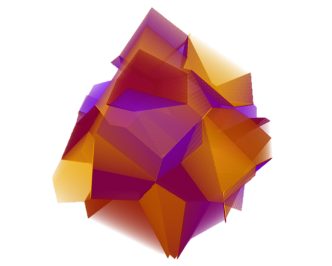

# SymPhas

*A compile-time symbolic algebra framework for phase-field simulations.*

**SymPhas** (Symbolic Phase Field Solver) is a comprehensive C++ framework for implementing high-performance solvers for phase-field problems. It provides a Domain Specific Language (DSL) that allows you to write mathematical equations in natural syntax, which is then compiled into optimized C++ code.

**Papers:**
- [SymPhas--General purpose software for phase-field, phase-field crystal and reaction-diffusion simulations](https://doi.org/10.1002/adts.202100351), Steven A. Silber and Mikko Karttunen, Adv. Theor. Sim. 5, 2100351 (2022). 
- Preprint: [arXiv:2109.02598](https://arxiv.org/abs/2109.02598)

<p align="center">


</p>

<p align="center">



</p>

## Key Features

- **Domain Specific Language**: Write mathematical equations in natural syntax using C++ macros
- **High Performance**: Compile-time symbolic algebra eliminates runtime branching
- **Multiple Field Types**: Support for scalar, complex, and vector fields
- **Parallelization**: Built-in MPI and CUDA support
- **Modular Architecture**: Extensible framework for custom solvers and models

## Applications

SymPhas supports any multi-phase-field problem that can be formulated field-theoretically:
- Dendrite growth simulations
- Reaction-diffusion systems
- Phase-field crystal problems
- Biological systems modeling
- Turing pattern formation 

## Quick Start

### Prerequisites

- C++17 compatible compiler (GCC 7+, Clang 6+)
- CMake 3.22 or higher
- FFTW3 library (for Fourier Transform solvers)

### Installation

1. **Clone the repository**:
```bash
git clone https://github.com/SoftSimu/SymPhas.git
cd SymPhas
```

2. **Build with the tutorial example**:
```bash
mkdir build && cd build
cmake .. -DCMAKE_BUILD_TYPE=Release \
    -DMAIN_FILE="examples/tutorial/main.cpp" \
    -DSOLVER_INCLUDE_HEADER_DIR="../examples/solvers" \
    -DSOLVER_INCLUDE_HEADER_NAME="../solverinclude.h"
make 
```

3. **Run the simulation**:
```bash
./symphas_impl
```

### Simple Example

Here's a minimal Allen-Cahn model simulation:

```cpp
#include "symphas.h"

// Define the Allen-Cahn model
MODEL(AllenCahn, (SCALAR),
    EVOLUTION(dop(1) = lap(op(1)) - (power(op(1), 2) - 1_n) * op(1))
)

int main() {
    using namespace symphas;
    
    // Set up a 2D grid: 64x64 with periodic boundaries
    auto interval = BoundaryType::PERIODIC || 64_h / 0.5_dh;
    auto grid = interval * interval;
    auto params = grid << (Inside::UNIFORM <<= {-0.1, 0.1});
    
    // Create and run model
    model_AllenCahn_t<2, SolverFT<Stencil2d2h<>>> model{params};
    find_solution(model, 0.01, 1000);
    
    return 0;
}
```

### Building Your Own Project

1. **Create your project directory**:
```bash
mkdir myproject && cd myproject
```

2. **Create your main.cpp** with your model definition

3. **Build from SymPhas root**:
```bash
cd .. && mkdir build && cd build
cmake .. -DCMAKE_BUILD_TYPE=Release \
    -DMAIN_FILE="myproject/main.cpp" \
    -DSOLVER_INCLUDE_HEADER_DIR="../examples/solvers" \
    -DSOLVER_INCLUDE_HEADER_NAME="../solverinclude.h"
make
```

## Documentation

For comprehensive documentation, tutorials, and advanced features, see [DOCUMENTATION_GUIDE.md](DOCUMENTATION_GUIDE.md).

## License and Citation

SymPhas is distributed under the **GNU Lesser General Public License (LGPL), version 3**.

Since SymPhas is supported by academic funding, we kindly ask you to cite our paper:
- Steven A. Silber and Mikko Karttunen, "SymPhas--General purpose software for phase-field, phase-field crystal and reaction-diffusion simulations", Adv. Theor. Sim. 5, 2100351 (2022).

## Contributing

We welcome contributions, bug reports, and feedback! Please use the GitHub issues page to report bugs or request features.
